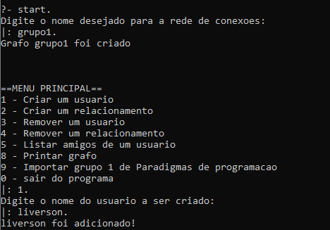
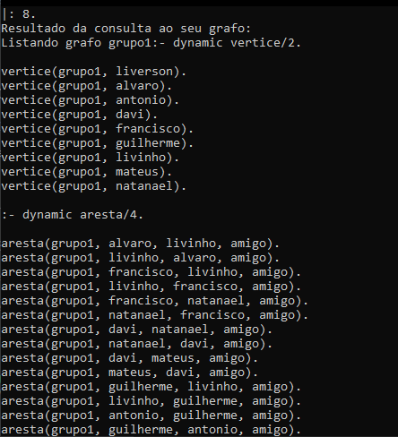

# Rede de Pessoas

**Disciplina**: FGA0210 - PARADIGMAS DE PROGRAMAÇÃO - T01 <br>
**Nro do Grupo (de acordo com a Planilha de Divisão dos Grupos)**: 01<br>
**Paradigma**: Lógico<br>

## Alunos
|Matrícula | Aluno |
| -- | -- |
| 18/0012002 |  Álvaro Gouveia |
| 19/0044799 |  Antônio Ferreira de Castro Neto |
| 19/0042419 |  Davi Matheus da Rocha de Oliveira |
| 17/0142329 |  Francisco Emanoel Ferreira |
| 19/0014032 |  Guilherme Rogelin Vial |
| 18/0022237 |  Liverson Furtado Severo |
| 14/0155350 |  Matheus Filipe Faria Alves de Andrade |
| 19/0058650 |  Natanael Fernandes Coelho Filho |

## Sobre 

O projeto em questão trabalha num contexto de uma rede de pessoas na qual essas pessoas são conectadas entre si. Na prática, essa rede é representada por grafos, nos quais os vértices representam as pessoas, e as arestas representam o relacionamento entre elas.

O projeto teve como inspiração os **Seis Graus de Kevin Bacon**, que por sua vez se baseia na **Teoria dos 6 graus de separação**. Esse tema consiste na ideia que a distância máxima entre duas pessoas no mundo seria no máximo 6 graus. Esse cenário pode ser compreendido por esse [post](https://ideiasesquecidas.com/2022/06/17/o-numero-de-bacon-e-o-algoritmo-da-distancia-minima/).

No contexto do projeto, se pudéssemos apresentar uma rede de pessoas contendo 7,8 bilhões de pessoas, poderíamos ver o Kevin Bacon (ou qualquer outra pessoa) a no máximo 6 pessoas de distância de você.

## Funcionalidades

Primeiramente, é solicitado o nome para a sua rede de pessoas. E depois o projeto apresenta algumas funcionalidades como: 

- **Criar um usuário**: Adiciona uma pessoa na rede de pessoas (adiciona um vértice para o grafo).
- **Criar um relacionamento:** Adiciona um novo relacionamento entre duas pessoas (adiciona uma aresta no grafo).
- **Remover um usuario:** Remove uma pessoa da rede de pessoas (exclui um vértice do grafo, e todas suas arestas).
- **Remover um relacionamento:** Remove um relacionamento entre duas pessoas (exclui uma aresta do grafo).
- **Listar amigos de um usuario:** Lista todos os relacionamentos de uma pessoa (lista todos os vértices conectado a um determinado vértice.)
- **Printar grafo:** Mostra toda a rede de pessoas (mostra todo o grafo).

Ao sair do programa, o grafo que foi gerado é apagado, pois ainda não há uma base de dados para gravar as informações.

## Screenshots



## Instalação 
**Linguagens**: Prolog<br>
**Tecnologias**: SWI-Prolog<br>

### Via docker
Se você tiver [docker](https://docs.docker.com/get-docker/) e [docker-compose](https://docs.docker.com/compose/install/) instalados, basta rodar o comando a seguir na raiz do projeto:

Para construir o container:

```make build```

Para rodar o container:

```make run```
  
Para parar o container em andamento:

```make down```

### Manualmente
Para instalar manualmente, você precisará do [swipl](https://www.swi-prolog.org/download/stable). Com ele instalado, basta executar  
```swipl grafo.pl``` dentro da pasta src.

## Uso 
Para utilizar o projeto após a inicialização digite:

    start.

Após este comando o programa irá inicializar pedindo o nome da rede social. Após isso o usuário irá para o menu principal. A idéia é implementar o funcionamento de um grafo de rede social utilizando prolog. Conseguir adicionar amizade, desfazer amizade, apagar usuário e chegar em um usuário a partir de outro.

## Vídeo
Adicione 1 ou mais vídeos com a execução do projeto.
Procure: 
(i) Introduzir o projeto;
(ii) Mostrar passo a passo o código, explicando-o, e deixando claro o que é de terceiros, e o que é contribuição real da equipe;
(iii) Apresentar particularidades do Paradigma, da Linguagem, e das Tecnologias, e
(iV) Apresentar lições aprendidas, contribuições, pendências, e ideias para trabalhos futuros.
OBS: TODOS DEVEM PARTICIPAR, CONFERINDO PONTOS DE VISTA.
TEMPO: +/- 15min

## Participações
| Nome do Membro                           | Contribuição                                         | Significância da Contribuição para o Projeto (Excelente/Boa/Regular/Ruim/Nula) |
| ---------------------------------------- | ---------------------------------------------------- | ------------------------------------------------------------------------------ |
| Álvaro Gouveia -18/0012002		                                   |  Auxilio nas funções de adicionar usuário e relacionamento | Boa | 
| Antônio Ferreira de Castro Neto - 19/0044799| Funcionalidades do grafo, tentativas de integração do algortimo de Dijkstra e atualizações no ReadMe.    | Boa                                                                            |
| Davi Matheus da Rocha de Oliveira - 19/0042419	         |    Auxilio e complementação das funcionalidades de grafo e temtatova de integração do alogrtimo de Dijsktra e de um banco de dados mais robusto    | Boa                                                                            |
| Francisco Emanoel Ferreira   - 17/0142329	              |  Criação da primeira versão do algorito de Dijsktra com algumas adaptações e Escrever algumas descrição no Readme.  | Boa                                                                             |
|Guilherme Rogelin Vial	- 19/0014032	    |   -    | Boa                                                                       |
| Liverson Furtado Severo	- 18/0022237	            | Criação da inicialização e menu do programa, adição de prevenções de erros do programa nos métodos de criar e retirar usuários e relacionamentos, correção do documento a rodar no dockerfile e atualização de algumas informações no REAME | Boa                                                                          |
| Matheus Filipe Faria Alves de Andrade	- 14/0155350	 |   Auxílio na criação das funções de remoção de vértices e arestas   | Boa                                                                          |
| Natanael Fernandes Coelho Filho	- 19/0058650	                 |    -   | Boa                                                                         |

## Outros
Quaisquer outras informações sobre o projeto podem ser descritas aqui. Não esqueça, entretanto, de informar sobre:
* Lições Aprendidas:
   * Entendendo os alguns conceitos do  paradigma lógico
   * Entendendo os princípios da sintaxe e semântica da linguagem prolog.
 
* Percepções:
   * Por estamos acostumados com outros tipos de paradigmas como por exemplo o estruturado, acabamos adaptando algumas coisas para para o paradigma lógico, mas o grupo conseguiu se adaptar bem com o novo paradigma.
 
* Contribuições e Fragilidades
   * Alguns membros tiveram mais facilidade no paradigma, logo os mesmo ficaram mais ativos no projeto.
  
* Trabalhos Futuros.
   * Implementar o algoritmo de busca, tentamos implementar o algoritmo de Dijkstra porém encontramos algumas dificuldades, caso alguém queira terminar implementação fique atento com o tamanho da base dados e lembra de deixar os métodos o mais eficiente possível, caso você não faça isso, é bem provável que leve erro de estouro da memória heap. Segue abaixo o print do erro relacionado a estouro da memoria heap.


## Fontes
- swi=prolog: https://www.swi-prolog.org/
